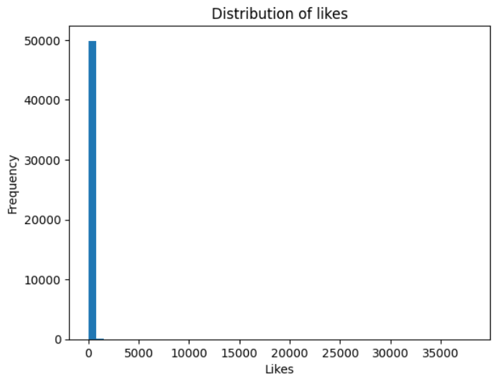
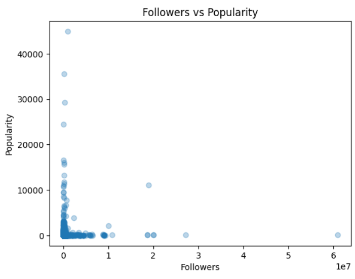
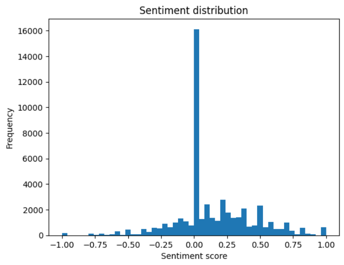

#  Food Tweet Popularity Prediction using Machine Learning

##  Project Overview

This project explores the prediction of popularity for food-related tweets using Machine Learning techniques. The objective is to identify the factors that influence user engagement on social media.

Rather than relying solely on likes, a custom popularity score was created to better represent overall engagement.

### Popularity Definition

```text
Popularity = Likes + Retweets + Replies + Quotes + Sentiment Score
```

This approach incorporates both user interactions and the emotional dimension of tweet content, providing a richer representation of popularity. 

---

##  Objectives

The main goals of this project are:

- Analyze food-related tweets from Twitter/X.
- Extract sentiment information from tweet text.
- Transform textual content into numerical features using TF-IDF.
- Build regression models capable of predicting tweet popularity.
- Compare different Machine Learning algorithms and evaluate their performance.
- Identify the most influential factors affecting tweet engagement.

---

##  Dataset

The project uses the **Food Tweets Dataset**, containing approximately **50,000 food-related tweets**. The dataset includes tweet information, engagement metrics, user statistics, and media-related data.

### Main Features

- Tweet text
- Tweet language
- Likes count
- Retweets count
- Replies count
- Quotes count
- User followers count
- User following count
- User tweet count
- Media information

After preprocessing, only English tweets were selected for analysis. 

---

##  Data Preprocessing

Several cleaning operations were performed before training the models:

### Data Cleaning

- Removal of missing values
- Selection of English-language tweets
- Removal of URLs
- Removal of punctuation and special characters
- Conversion to lowercase
- Removal of unnecessary spaces

### Text Processing

Tweets were transformed into a clean textual format suitable for Natural Language Processing (NLP).

Example:

```text
Original:
"Check out this amazing burger!!!  https://..."

Cleaned:
"check out this amazing burger"
```

---

##  Sentiment Analysis

Sentiment analysis was performed using the **TextBlob** library.

Each tweet receives a polarity score:

| Sentiment | Score Range |
|------------|------------|
| Negative | -1 to 0 |
| Neutral | 0 |
| Positive | 0 to +1 |

The sentiment score is then integrated into the popularity metric. 

---

##  Feature Engineering

### TF-IDF Vectorization

The textual content was transformed into numerical vectors using:

```python
TfidfVectorizer(max_features=500)
```

TF-IDF helps identify the most representative words within the tweet corpus. 

### Numerical Features

The following additional variables were included:

- User followers count
- Sentiment score

The TF-IDF matrix and numerical features were combined into a single feature set for model training.

---

##  Machine Learning Models

Two regression algorithms were evaluated:

### 1. Linear Regression

A baseline model used to capture linear relationships between features and popularity.

### 2. Random Forest Regressor

An ensemble learning algorithm capable of modeling complex and non-linear relationships while handling noisy data effectively. 

---

##  Exploratory Data Analysis

### Screenshot 1 - Distribution of Likes

<p align="center">
  
</p>

---

### Screenshot 2 - Followers vs Popularity

<p align="center">
  
</p>

---

### Screenshot 3 - Sentiment Distribution

<p align="center">
  
</p>

---

##  Model Training

The dataset was divided into training and testing subsets:

```python
train_test_split(
    X,
    y,
    test_size=0.2,
    random_state=42
)
```

Evaluation metrics:

- RMSE (Root Mean Squared Error)
- R² Score

---

##  Results

The models were compared using:

| Model | RMSE | R² Score |
|---------|---------|---------|
| Linear Regression | Your Result | Your Result |
| Random Forest | Your Result | Your Result |

From the experiments, the Random Forest Regressor achieved better performance than Linear Regression, demonstrating its ability to capture complex patterns within the data. 

---

##  Key Findings

- Tweet popularity is influenced by multiple factors.
- Sentiment contributes to user engagement.
- User influence (followers count) impacts popularity.
- Textual content contains valuable predictive information.
- Data distribution is highly imbalanced, with only a small number of tweets achieving very high engagement levels.
- Random Forest outperforms Linear Regression due to its non-linear modeling capability. 

---

##  Technologies Used

- Python
- Pandas
- NumPy
- Matplotlib
- Scikit-Learn
- TextBlob
- TF-IDF
- Random Forest Regressor
- Linear Regression

---

##  Project Structure

```text
Food-Tweet-Popularity-Prediction/
│
├── Food_tweets.csv
│
├── images/
│   ├── figure1.PNG
│   ├── figure2.PNG
│   └── figure3.PNG
│
├── Food_tweet_popularity.ipynb
│
├── ALEXIS_JOSE_GUERIN_ANANGMO_SOLFACK_ML_project_report.pdf
│
└── Readme.md
```

---

##  Future Improvements

- Use advanced NLP models such as BERT or RoBERTa.
- Incorporate emoji analysis.
- Perform feature importance analysis.
- Handle data imbalance using resampling techniques.
- Experiment with Gradient Boosting and XGBoost models.

---

##  References

1. Breiman, L. (2001). *Random Forests*. Machine Learning, 45(1), 5–32.
2. TextBlob Documentation: https://textblob.readthedocs.io/ 
3. Food Tweets Dataset (50,000 tweets). 

---

##  Author

**Alexis José Guerin Anangmo Solefack**

Machine Learning and Data Mining Project

University of Trieste

Academic Year 2025–2026
